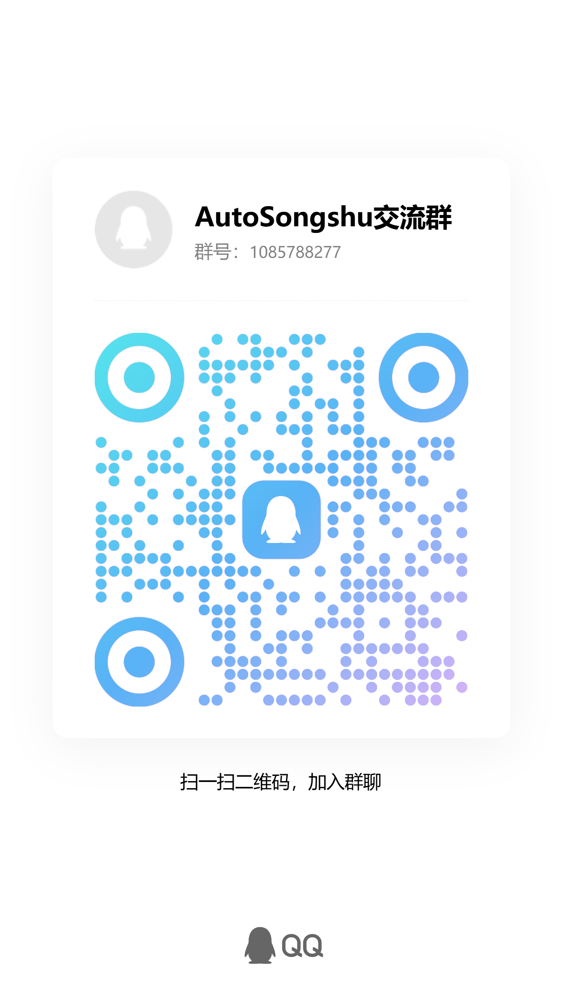

# AutoSongshu Agent (自动松鼠) 🐿️

<p align="center">
  <a href="./docker/">
    
  </a><!--
  --><a href="https://www.python.org/">
    
  </a><!--
  --><a href="./LICENSE">
    
  </a>
</p>

## 技术进步应当服务于减轻劳动、缩短工时、改善劳动条件和增进共同福祉，而不应成为剥夺劳动者生计、削弱劳动者议价能力或扩大管理控制的工具。任何复制、修改、分发、托管、集成或部署本项目者，均需在遵守本项目开源协议的前提下行事。

# 📜 劳动人民权益保护源码许可倡议 (License & Appeal)

本项目采用我们起草的 **[劳动人民权益保护源码许可 v1.2 (Working People's Rights Protection Source License)](./LICENSE)**。（For English version, please see **[LICENSE.en](./LICENSE.en)**）

我们在协议中不仅融入了严格的 Copyleft 开源传染机制（防止商业“白嫖”与 SaaS 规避），更首创性地加入了**劳动者权益保护基线**（如禁止将代码用于裁员替代、禁止通过技术变相压榨、必须保障员工双休等）。

在此，我们诚挚地呼吁广大开发者：**如果您同样不希望自己的心血代码被用作剥削打工人的工具，欢迎在您的开源项目中使用或参考这份《劳动人民权益保护源码许可》！** 让我们联合起来，捍卫我们自身的合法权益。

# 简介

AutoSongshu 是一个自动化 Web 渗透测试辅助 Agent。它旨在通过大语言模型（LLM）的推理能力，结合浏览器自动化和安全扫描工具，为安全工程师提供一个“半自动驾驶”的渗透测试工作台。

> ⚠️ **警告**：本项目仅供学习交流及在**获得充分授权**的目标上进行安全测试。严禁用于任何非法用途。

***

## 🌟 核心功能

- 🧠 **自主任务规划**：Agent 能根据目标自动拆解任务、选择工具并动态调整策略。
- 🌐 **深度浏览器集成**：通过 Playwright + CDP 接入 Chromium/Chrome/Edge，支持复杂的单页应用（SPA）测试及动态行为分析。
- 🛡️ **授权边界控制 (Scope Guard)**：内置严格的域名和路径过滤，确保所有测试行为仅限于授权范围内。
- 🛠️ **丰富的工具箱**：
  - **基础工具**：HTTP 请求分析、安全响应头检查、CSRF 面扫描等。
  - **集成技能 (Skills)**：一键调用 `nmap`、`sqlmap`、`dirsearch` 等成熟安全工具。
  - **代码沙箱**：Agent 可在安全的 Python 沙箱中编写并运行自定义脚本。
- 📝 **结构化产物**：实时记录 Findings，自动保存截图、网络日志，并能生成专业的 Markdown 渗透测试报告。
- 💻 **交互式 Web 控制台**：提供类 ChatGPT 的多轮对话界面，支持实时查看执行过程和归档历史。

***

## 🚀 快速启动

你可以选择使用 **Docker（推荐）** 或 **本地环境** 启动。

### 方式一：使用 Docker 启动 (推荐)

这是最简单、环境最一致的启动方式，镜像内已预装所有必要的安全工具和浏览器。

#### 快速启动

1. **设置环境变量**（两种方式任选其一）：

   **方式 A - 直接设置环境变量：**
   ```bash
   export AUTOSONGSHU_MODEL_NAME=your-model-name
   export AUTOSONGSHU_MODEL_API_KEY=your-api-key
   export AUTOSONGSHU_MODEL_BASE_URL=https://your-api-endpoint.com/v1
   ```
   **方式 B - 使用 .env 文件**（可选）：
   ```bash
   cp docker/.env.example .env
   # 编辑 .env 文件，填写你的 API_KEY 等配置
   ```
2. **选择版本启动**：

   **国内用户（使用国内镜像源，速度更快）：**
   ```bash
   cd docker
   docker-compose -f docker-compose-cn.yml up -d
   ```
   **海外用户（使用官方源）：**
   ```bash
   cd docker
   docker-compose up -d
   ```
3. **访问界面**：
   打开浏览器访问 <http://localhost:8000>

#### 手动构建（可选）

如果你需要重新构建镜像（例如修改了代码）：

**国内用户：**

```bash
cd docker
docker-compose -f docker-compose-cn.yml up --build -d
```

**海外用户：**

```bash
cd docker
docker-compose up --build -d
```

**查看日志：**

```bash
docker-compose logs -f autosongshu
```

**停止服务：**

```bash
docker-compose down
```

***

### 方式二：本地开发环境启动

确保您的电脑上有UV（Python 包管理器）和Git。如果没有，请根据您的操作系统安装。

配置.env 文件，填写你的模型名称、API 密钥和服务地址。

双击 ‘start-autosongshu-web.bat’ 启动 Web 控制台。

***

## ⚙️ 核心配置

项目主要通过 `.env` 文件进行配置，核心变量包括：

- **模型配置**：
  - `AUTOSONGSHU_MODEL_NAME`: 模型名称（如 `kimi-k2.5`）。
  - `AUTOSONGSHU_MODEL_API_KEY`: 你的 API 密钥。
  - `AUTOSONGSHU_MODEL_BASE_URL`: API 服务地址。
- **数据库持久化**：
  - `AUTOSONGSHU_DATABASE_URL`: 默认为本地 SQLite。在 Docker 中，数据会持久化到 `autosongshu_data` 卷中。
- **浏览器设置**：
  - `AUTOSONGSHU_BROWSER_HEADLESS`: 是否开启无头模式（Docker 中默认为 `true`）。

***

## 📂 项目结构

- [src/](file:///e:/Code/LLM/AUTOsongshu/src): 核心源代码。
- [docker/](file:///e:/Code/LLM/AUTOsongshu/docker): Dockerfile 及容器化部署脚本。
- [skills/](file:///e:/Code/LLM/AUTOsongshu/skills): 扩展技能目录（nmap, sqlmap, dirsearch 等）。
- [scripts/](file:///e:/Code/LLM/AUTOsongshu/scripts): 各类运维和启动辅助脚本。
- [artifacts/](file:///e:/Code/LLM/AUTOsongshu/artifacts): 扫描结果、截图和报告的输出目录。

***

## ⚖️ 许可说明

本项目采用自定义的**源码公开 + 劳动保护**许可证。

- 详细许可条款见 [LICENSE](file:///e:/Code/LLM/AUTOsongshu/LICENSE)。
- 核心宗旨：允许技术研究与改造，但严禁任何因部署本项目而导致劳动者待遇恶化（如裁员、减薪、过度加班等）的行为。

***

## 🤝 贡献与反馈

欢迎提交 Issue 或 Pull Request 来完善工具集和 Agent 策略。在使用过程中请务必遵守当地法律法规。

## 交流群



点击加入AutoSongshu交流群：[1085788277](https://qm.qq.com/q/x0lEkhztCw)
